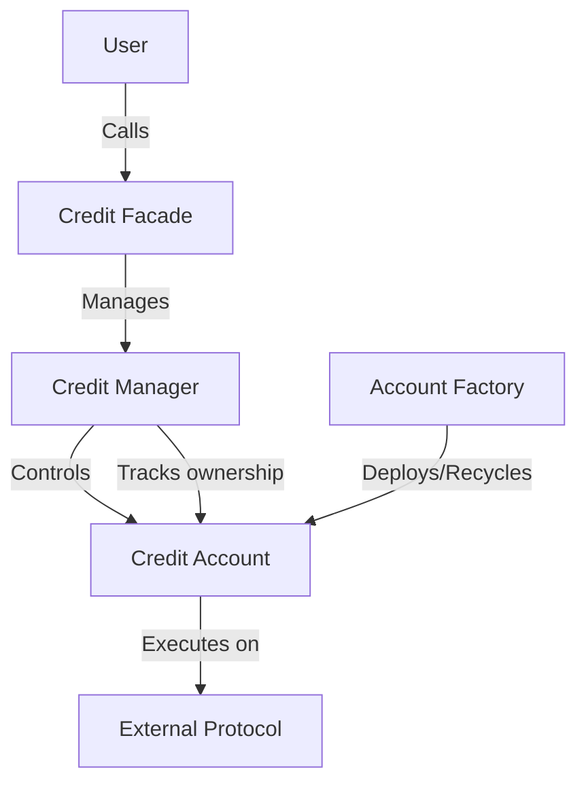

## Overview

Credit Account V3 is a minimal contract that serves as a proxy for user interactions with external protocols. Each credit account represents a single leveraged position owned by a user. The account can hold multiple tokens as collateral and execute calls to whitelisted protocols through adapters.

**Contract Location**: `contracts/credit/CreditAccountV3.sol`

**Interface**: `ICreditAccountV3.sol`

## Key Features

- Lightweight proxy for leveraged positions
- Token transfer functionality (restricted to credit manager)
- External contract execution (restricted to credit manager)
- Emergency rescue functionality (restricted to account factory)
- Immutable connection to credit manager and account factory

## State Variables

### Immutable Variables

<ParamField path="version" type="uint256">
  Contract version (always returns `3_10`)
</ParamField>

<ParamField path="contractType" type="bytes32">
  Contract type identifier (always returns `"CREDIT_ACCOUNT"`)
</ParamField>

<ParamField path="factory" type="address">
  Account factory that deployed this credit account
</ParamField>

<ParamField path="creditManager" type="address">
  Credit manager this account is connected to
</ParamField>

## Functions

### safeTransfer

```solidity
function safeTransfer(
    address token,
    address to,
    uint256 amount
) external
```

Transfers tokens from the credit account to a specified address.

<ParamField path="token" type="address" required>
  Token to transfer
</ParamField>

<ParamField path="to" type="address" required>
  Transfer recipient
</ParamField>

<ParamField path="amount" type="uint256" required>
  Amount to transfer
</ParamField>

<Warning>
Only callable by the credit manager. Uses SafeERC20 for safe transfers.
</Warning>

### execute

```solidity
function execute(
    address target,
    bytes calldata data
) external returns (bytes memory result)
```

Executes a function call from the credit account to a target contract.

<ParamField path="target" type="address" required>
  Contract to call
</ParamField>

<ParamField path="data" type="bytes" required>
  Calldata to pass to the target contract
</ParamField>

<ParamField path="result" type="bytes">
  Returns the result of the function call
</ParamField>

<Warning>
Only callable by the credit manager. The target contract must be whitelisted.
</Warning>

<Note>
This function is used by adapters to interact with external protocols on behalf of the credit account.
</Note>

### rescue

```solidity
function rescue(
    address target,
    bytes calldata data
) external
```

Executes a function call for emergency token recovery.

<ParamField path="target" type="address" required>
  Contract to call
</ParamField>

<ParamField path="data" type="bytes" required>
  Calldata to pass to the target contract
</ParamField>

<Warning>
Only callable by the account factory. This function is used to rescue funds that were accidentally left on the account after closure.
</Warning>

## Access Control

The credit account implements strict access control through modifiers:

### creditManagerOnly

Ensures the function caller is the connected credit manager.

- Applied to: `safeTransfer()`, `execute()`
- Reverts with: `CallerNotCreditManagerException`

### factoryOnly

Ensures the function caller is the account factory.

- Applied to: `rescue()`
- Reverts with: `CallerNotAccountFactoryException`

## Architecture

Credit accounts follow a minimal proxy pattern:

1. **Deployment**: Created by the account factory when a user opens a position
2. **Ownership**: Tracked in the credit manager, not stored in the account itself
3. **Lifecycle**: Returned to the factory pool when closed, can be reused for new positions
4. **Execution**: All actions are initiated through the credit manager and credit facade



## Constructor

```solidity
constructor(address _creditManager)
```

<ParamField path="_creditManager" type="address" required>
  Credit manager to connect this account to
</ParamField>

<Note>
The constructor sets both the credit manager and factory (from `msg.sender`) as immutable variables.
</Note>

## Security Considerations

<Warning>
Credit accounts should NEVER hold tokens or positions after closure. Any remaining assets can only be recovered through the factory's `rescue()` function.
</Warning>

### Key Security Features:

1. **Immutable Connections**: Credit manager and factory addresses cannot be changed
2. **Restricted Access**: Only credit manager can transfer tokens and execute calls
3. **No Direct User Access**: Users cannot call credit account functions directly
4. **Emergency Recovery**: Factory can rescue accidentally left tokens

## Example Usage

Credit accounts are not called directly by users. Here's how they're used internally:

### Token Transfer (Internal)

```solidity
// Called by Credit Manager
creditAccount.safeTransfer(
    USDC,
    pool,
    repaymentAmount
);
```

### Protocol Execution (Internal)

```solidity
// Called by Credit Manager via Adapter
bytes memory result = creditAccount.execute(
    uniswapRouter,
    abi.encodeCall(
        IUniswapV3Router.exactInputSingle,
        (swapParams)
    )
);
```

### Emergency Rescue (Internal)

```solidity
// Called by Account Factory for token recovery
creditAccount.rescue(
    token,
    abi.encodeCall(
        IERC20.transfer,
        (receiver, amount)
    )
);
```

## Gas Optimization

Credit Account V3 is designed for minimal gas usage:

- **No Storage**: Only immutable variables (stored in bytecode)
- **Simple Logic**: Minimal validation, relies on credit manager for checks
- **Reusable**: Accounts are recycled via the factory to save deployment costs
- **Efficient ABI**: Uses `abicoder v1` for smaller bytecode

## Related Contracts

- **Credit Manager V3**: Controls all credit account operations
- **Credit Facade V3**: User interface for account management
- **Account Factory**: Deploys and recycles credit accounts
- **Adapters**: Enable interactions with external protocols

## Implementation Notes

<Note>
Credit Account V3 uses OpenZeppelin's `SafeERC20` library and `Address.functionCall` for safe external interactions.
</Note>

### Dependencies

```solidity
import {IERC20} from "@openzeppelin/contracts/token/ERC20/IERC20.sol";
import {SafeERC20} from "@1inch/solidity-utils/contracts/libraries/SafeERC20.sol";
import {Address} from "@openzeppelin/contracts/utils/Address.sol";
```

## Common Patterns

### Checking Credit Account Ownership

```solidity
// Get the account owner from credit manager
address owner = creditManager.getBorrowerOrRevert(creditAccount);
require(msg.sender == owner, "Not account owner");
```

### Safe Token Operations

```solidity
// Credit manager ensures token is allowed
creditAccount.safeTransfer(token, recipient, amount);
```

### Adapter Calls

```solidity
// Credit manager sets account as active
creditManager.setActiveCreditAccount(creditAccount);

// Adapter executes via credit account
creditAccount.execute(target, callData);

// Credit manager unsets active account
creditManager.setActiveCreditAccount(INACTIVE_CREDIT_ACCOUNT_ADDRESS);
```
